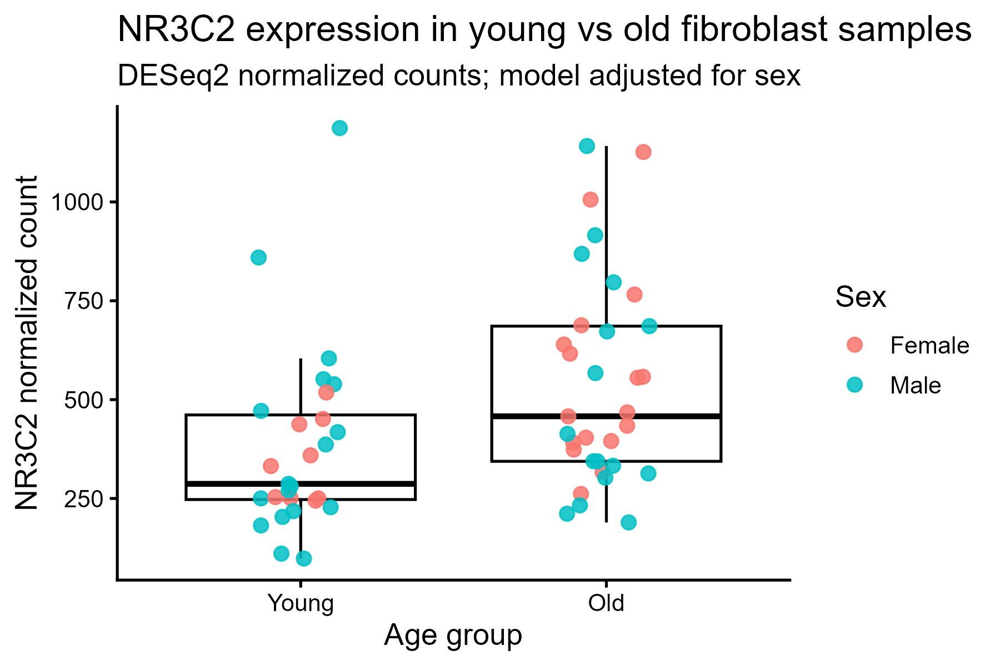
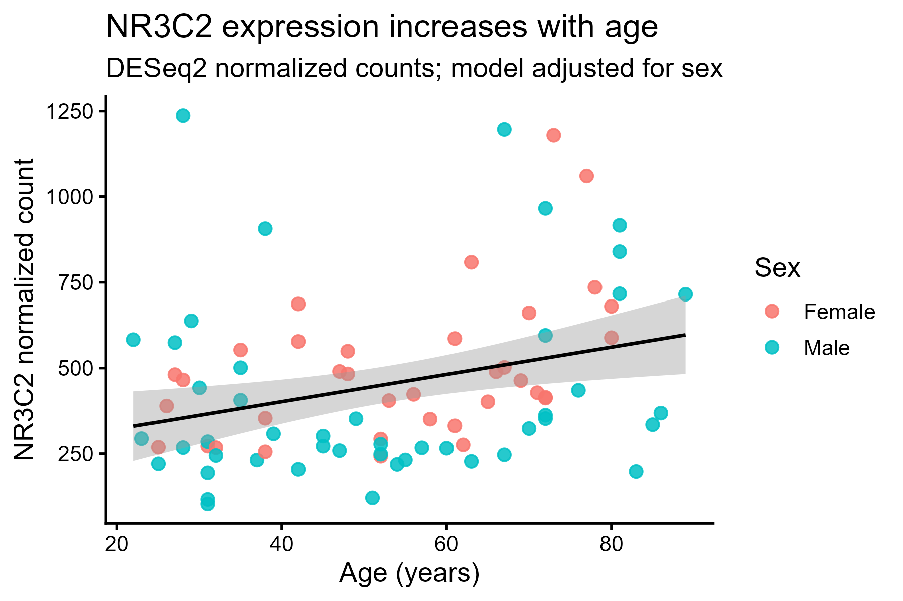
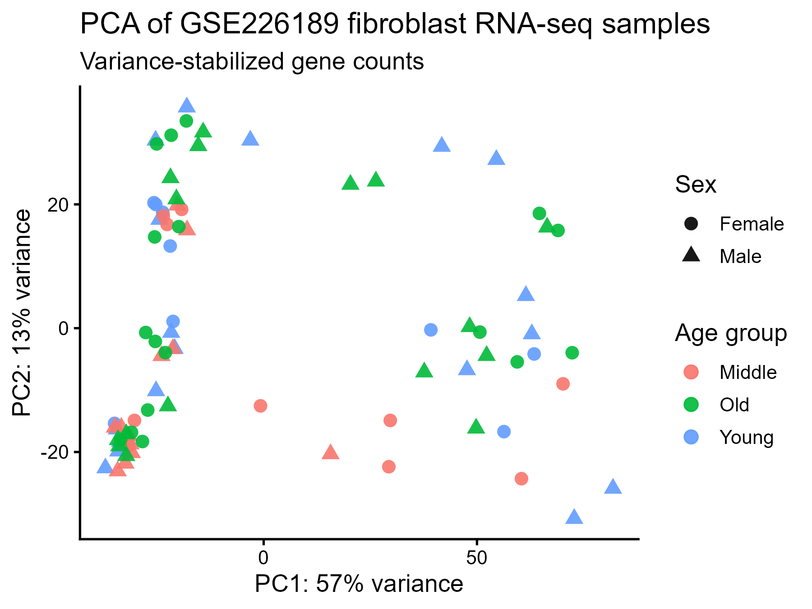
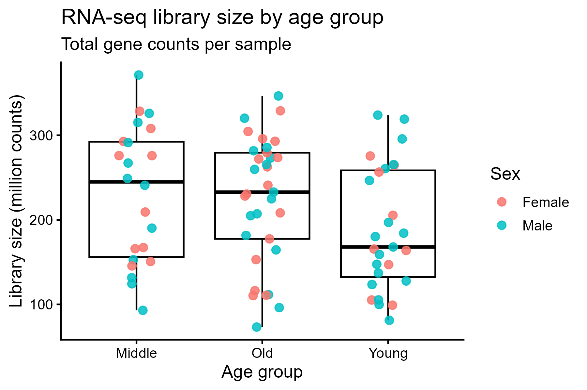
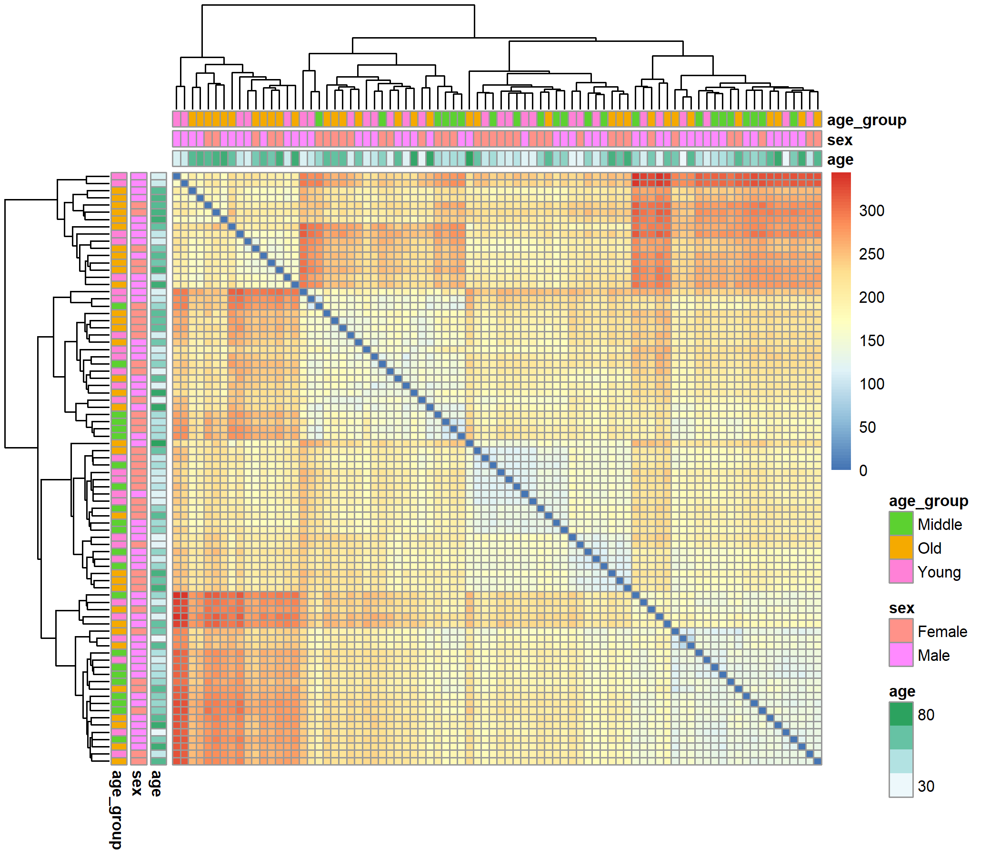
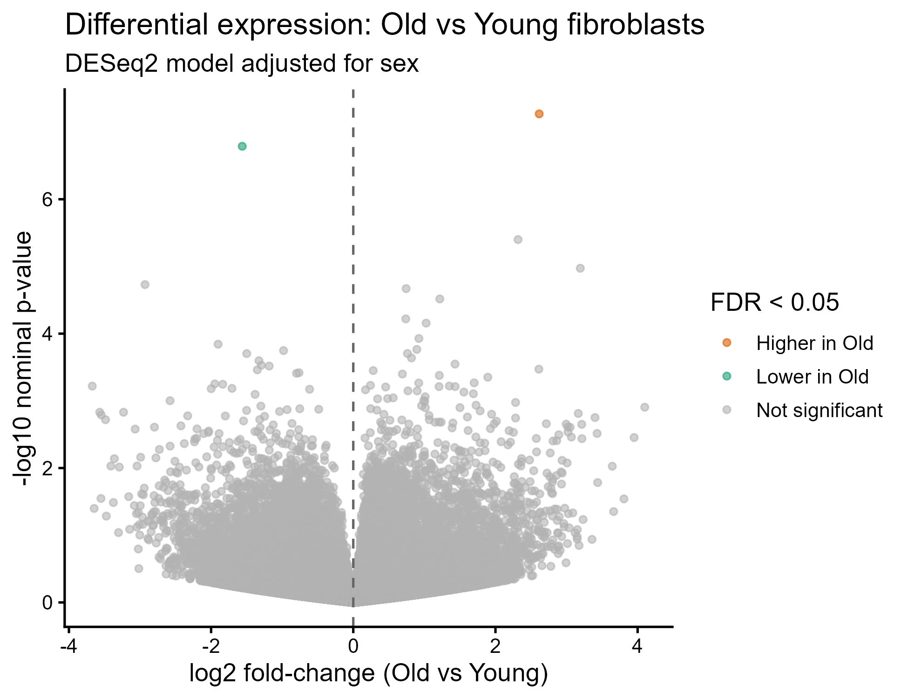
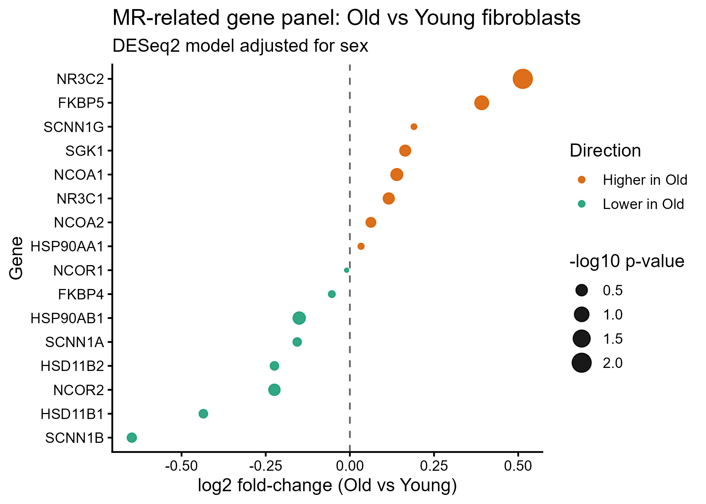

# NR3C2 expression and aging in GSE226189 fibroblast RNA-seq

This repository analyzes NR3C2 (mineralocorticoid receptor) expression in primary skin fibroblast RNA-seq samples from GEO dataset GSE226189.

## Dataset

- GEO accession: GSE226189
- Samples: 82 primary skin fibroblast RNA-seq samples
- Age range: 22 to 89 years
- Gene counts: featureCounts gene-level counts generated after STAR alignment to hg19 Ensembl v82

## Analysis question

Does NR3C2 expression differ between young and aged fibroblast samples, and does NR3C2 expression change with age?

## Age grouping

- Young: age < 40 years
- Old: age > 60 years
- Middle: age 40-60 years, excluded from the Young vs Old comparison but included in continuous-age analysis

## Statistical analysis

Analyses were performed using DESeq2 with raw featureCounts gene counts.

Two models were used:

1. Young vs Old comparison, adjusted for sex:

```r
~ sex + age_group
```

2. Continuous age analysis, adjusted for sex:

```r
~ sex + age_centered
```

## Main NR3C2 results

Young vs Old, adjusted for sex:

- log2 fold-change, Old vs Young: 0.514
- Approximate fold-change: 1.43 higher in Old samples
- Nominal p-value: 0.0093
- Adjusted p-value: 0.999982

Continuous age model, adjusted for sex:

- log2 fold-change per year: 0.0110
- Nominal p-value: 0.0090
- Adjusted p-value: 0.6214

NR3C2 shows a modest increase with age in this dataset. Because NR3C2 was a pre-selected gene of interest, the nominal p-values are informative for the targeted question. However, NR3C2 is not significant after genome-wide multiple-testing correction.

## Repository structure

```text
scripts/          Reproducible R analysis script
metadata/         Clean sample metadata
data_processed/   Combined gene count matrix
results/          NR3C2 result tables
figures/          NR3C2 plots
docs/             Notes and documentation
```

## Reproducing the analysis

Open the RStudio project and run:

```r
source("scripts/01_nr3c2_aging_analysis.R")
```

The script downloads the GEO gene count files if they are not already present, rebuilds the count matrix, runs DESeq2, and saves result tables and figures.

## Notes

Raw downloaded GEO count files in `data_raw/gene_counts/` are excluded from GitHub using `.gitignore` because they can be recreated by the analysis script.

## Figures

### NR3C2 expression by age group



### NR3C2 expression across age



## Quality control

PCA and sample-level QC were performed using all 82 samples.

### PCA by age group and sex



### Library size QC



### Sample distance heatmap



A short QC interpretation is available in `docs/QC_summary.md`.

## Genome-wide differential expression

A genome-wide DESeq2 analysis was performed for Old vs Young samples while adjusting for sex.

- Genes/features tested: 49,704
- Significant genes at FDR < 0.05: 2
- Higher in Old: FGF9
- Lower in Old: NEFH

### Volcano plot



The full annotated differential expression table is available in `results/DESeq2_all_genes_old_vs_young_adjusted_for_sex_annotated.csv`.

## Targeted MR-related gene panel

A targeted mineralocorticoid receptor-related gene panel was examined using the Old vs Young DESeq2 model adjusted for sex.

The panel included NR3C2, corticosteroid metabolism genes, chaperones, nuclear receptor cofactors, glucocorticoid receptor NR3C1, SGK1, and epithelial sodium channel subunits.

NR3C2 showed the strongest nominal signal in this targeted panel, but no MR panel gene passed panel-adjusted FDR < 0.05.



The MR panel result table is available in `results/MR_gene_panel_old_vs_young_adjusted_for_sex.csv`.
